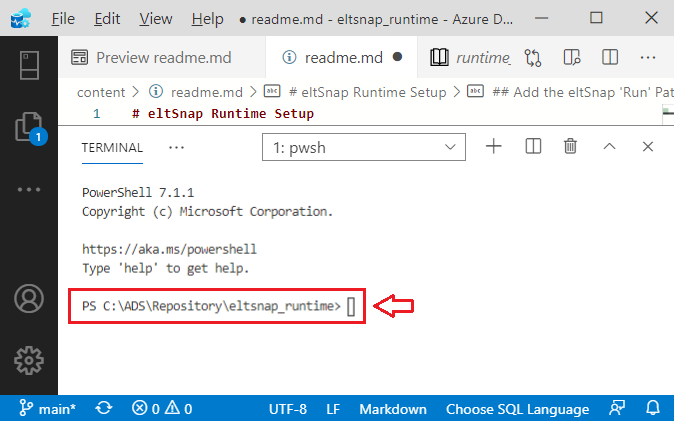

# eltSnap Runtime Setup

This solution contains the runtime engine used by both eltSnap and notebookSnap.

## Add the eltSnap 'Run' Path to the $ENV:PATH Variable

1. Open a PowerShell Terminal window


## Change to the 'Run' Subdirectory

``` powershell
cd run
```

## Notebooks in this Solution

[Runtime Setup](runtime_setup.ipynb) - Configure the eltSnap runtime for your environment

[SQL Kernel](sql_notebook.ipynb) - Sample Notebook
